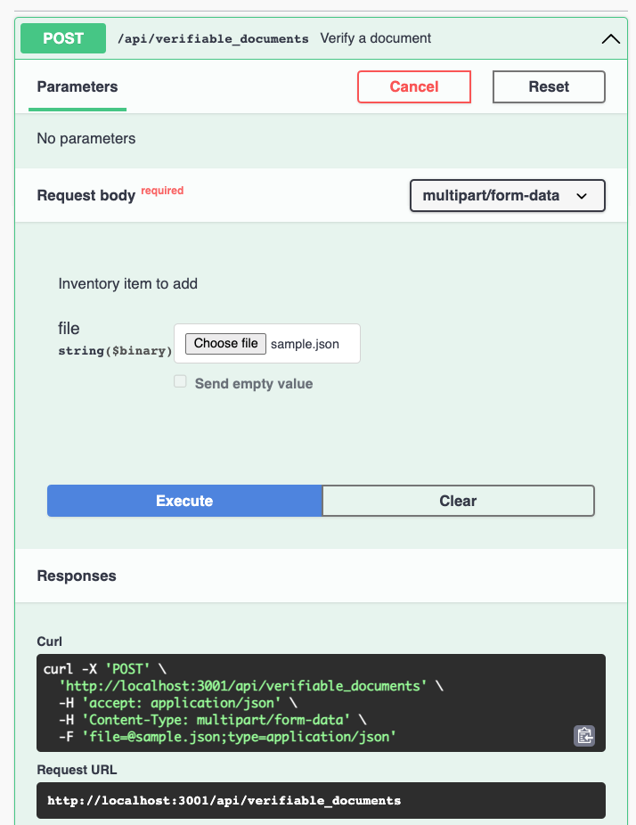
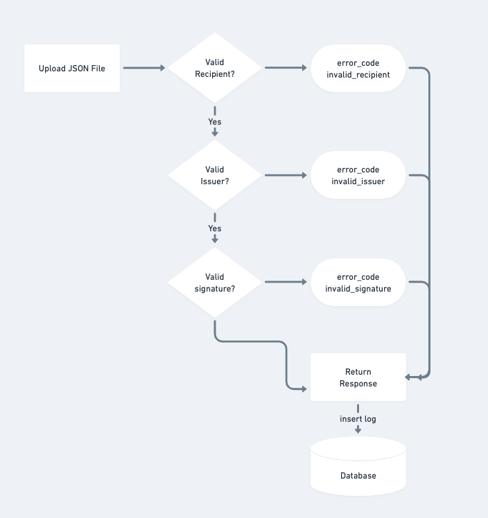

##  Document Verification Service
#### Prerequisites
This repository uses Laravel Sail + Docker spin up the required services: server and mysql
##### 1. Get a copy of the environment variable
Run the following commands to migrate the table

```php
cp .env.example .env
```

##### 2. Install required dependencies/gems

You can install the dependencies using the command given below. And you're ready!

```php
./vendor/bin/sail artisan migrate
./vendor/bin/sail up
```
##### 3. View API Documentation

To view the API documentation, it's available at the file called `verification_service.yaml`. You can either install VSCode extension called [Swagger Viewer](https://marketplace.visualstudio.com/items?itemName=Arjun.swagger-viewer) to preview the documentation or chrome extension called [swagger-viewer](https://chrome.google.com/webstore/detail/swagger-viewer/nfmkaonpdmaglhjjlggfhlndofdldfag) to view it directly on github (Extension currently not usable due to the updates on Github interface).

And you will be able to test out the API endpoints as below by uploading your file. There's a copy of the sample JSON file retrieved from the assessment page in `public/sample.json` which you can use it for testing out the API endpoints.



##### 4. Run test case (optional)
You can run all the test cases using the command given below.
```php
./vendor/bin/sail artisan test
```

#### Flow Diagram



### Rooms for Improvement if given more time
- Separate the DNS call to 3rd party service to a separate folder
- Be more stringent with the return type. As I come from a non PHP/Laravel background, I spend a lot of time figuring how to structure files and use the framework.
